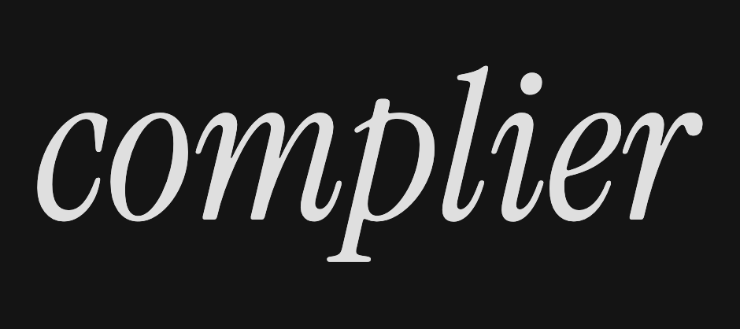
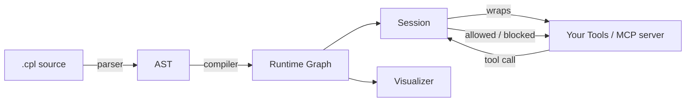

<p align="center">
  
</p>

<h1 align="center">complier</h1>

<p align="center">
  <strong>Contract enforcement for tool-using AI agents.</strong>
</p>

<p align="center">
  <a href="https://github.com/kavishsathia/complier/blob/main/LICENSE"></a>
  <a href="https://www.rust-lang.org/"></a>
</p>

## Overview

This language and framework allows you to define what your agent **can** do. It's meant to be a middle ground between n8n's workflows, which remove much of the runtime judgement an agent can have, and OpenClaw's runtime, which can literally do anything given a set of tools.

### Motivation

In December 2025, I developed [Sworn](https://github.com/kavishsathia/sworn). The core insight was: **the system prompt can act as both a directive for the agent and a source of truth to verify against**. You write a contract, the agent fulfils it, then check the deliverables against that contract.

I knew this was quite handwavy, getting another agent to review your agent's work doesn't guarantee much. But the bigger problem was that **verification was after the fact**. OpenClaw took off in January and we've seen how it can cause catastrophes mid-execution. We need something that **exists alongside the agent's runtime**, not after.

I did lose some sleep over this, and I eventually conceded it was the best I could offer. Between then and now (April 2026) though, I've learnt a lot. I wrote my own compiled programming language called [Star](https://github.com/kavishsathia/star), discovered the pattern of **intercepting tool calls not only to read them but to edit them entirely** to augment the agent's runtime ([Gauntlet](https://github.com/kavishsathia/gauntlet)), worked with parallel agents and tested out contracts within the same project ([Vroom](https://github.com/kavishsathia/vroom)), and most importantly, serendipitously rediscovered [HATEOAS](https://en.wikipedia.org/wiki/HATEOAS) when I accessed my old Notion notes (from when I just started programming).

The result after all that is a DSL to define loosely what your agent can do, and the interesting thing is: it's not just natural language like contracts v1, here we can actually **compile your DSL into a runtime graph**. The graph answers two important questions: **(1) can your agent do what it just did?** and **(2) what can your agent do next?** (just like HATEOAS). The big question now is: how do we communicate the state of the graph to the agent when it's executing? We can **piggyback on tool calls**, and when tool calls return, we **envelope them with information that the agent needs to know**, or even **reject tool calls** if it doesn't meet the workflow definition.

The entire framework relies on these critical insights that you just read.

> The original Python prototype lives in [`archive/`](archive) for reference. The active implementation is the Rust workspace under [`core/`](core).

## Features

- **Custom DSL** — A purpose-built language for defining agent workflows. Supports tool calls with parameters, `@llm` and `@human` steps, subworkflow invocation (`@call`, `@use`, `@inline`), branching, loops, unordered blocks, and parallel execution with `@fork`/`@join`.

- **Compiled runtime graph** — Your DSL compiles down (parse → AST → graph) into a directed node graph. At any point in execution, the graph knows what just happened and what's allowed next.

- **Contract checks** — Guard expressions that gate steps before they run. Model checks (`[check]`), human checks (`{check}`), and learned checks (`#{check}`) can be composed with `&&`, `||`, `!`, then wrapped with an expression-level policy such as `([check] && !{other}):halt`. If no policy is written, the default is 3 retries.

- **Guarantees** — Reusable contract expressions (`guarantee <name> <expr>`) that can be attached to entire workflows with `@always`, so certain invariants hold on every step.

- **Session tracking** — A `Session` binds a compiled contract to mutable runtime state, tracking the active workflow, completed steps, branch conditions, and a full event history. When a tool call is blocked, the agent gets a structured `BlockedToolResponse` with remediation info.

- **Function wrapping** — `FunctionWrapper` gates any async callable so contract enforcement happens transparently at the call boundary; the session lock is shared, so multiple wrappers can cooperate.

- **MCP proxies** — Two binaries ship alongside the library: `complier-mcp-proxy` guards a downstream MCP server over stdio, and `complier-remote-mcp-proxy` applies the same guard over streamable HTTP.

- **Visualizer** — A small Vite app under [`visualizer/`](visualizer) that renders a compiled contract as an interactive graph.

## Installation

The Rust crates are not published yet. Build from source:

```bash
git clone https://github.com/kavishsathia/complier.git
cd complier/core
cargo build --release
```

This produces the library crates plus the two proxy binaries (`complier-mcp-proxy`, `complier-remote-mcp-proxy`) in `core/target/release/`.

## Quick Start

Define a contract in a `.cpl` file:

```
guarantee safe [no_harmful_content]:halt

workflow "research" @always safe
    | @human "What topic?"
    | search_web
    | summarize style=([relevant] && [concise]):halt
    | @branch
        -when "technical"
            | @llm "Write detailed analysis"
        -else
            | @llm "Write brief summary"
    | @call send_report
```

Load it, build a session, and wrap your tools:

```rust
use std::sync::Arc;
use tokio::sync::Mutex;

use compiler::Contract;
use parser::parse;
use session::Session;
use wrappers::FunctionWrapper;

#[tokio::main]
async fn main() -> anyhow::Result<()> {
    let source = std::fs::read_to_string("workflow.cpl")?;
    let program = parse(&source)?;
    let contract = Contract::from_program(&program)?;

    let session = Arc::new(Mutex::new(Session::new(contract, None)?));
    let wrapper = FunctionWrapper::new(session.clone());

    let outcome = wrapper
        .call_async_json("search_web", Default::default(), None, |_decision| async {
            // your real tool call goes here
            serde_json::json!({ "results": [] })
        })
        .await;

    match outcome.into_result() {
        Ok(value) => println!("allowed: {value}"),
        Err(blocked) => println!("blocked: {blocked:?}"),
    }
    Ok(())
}
```

If a call isn't allowed at that point in the workflow, the wrapper returns a `BlockedToolResponse` with a structured `Remediation` block (reason, allowed next actions, missing requirements) instead of dispatching.

## Architecture



The Rust workspace (`core/`) is split into six crates:

1. **`ast`** — Typed AST for the `.cpl` language: `Program`, `Item`, `Workflow`, `Step`, `ProseGuard`, `ParamValue`, etc.

2. **`parser`** — Hand-written lexer plus recursive-descent parser that consumes whitespace-sensitive `.cpl` source and produces an AST.

3. **`compiler`** — Walks the AST and emits a `Contract` containing one `CompiledWorkflow` per `workflow` block. Each workflow becomes a map of `RuntimeNode`s (tool, llm, human, call, fork, join, branch, loop, unordered, start, end). `@always` guarantees are inlined as guards on every executable node.

4. **`runtime`** — Shared node/graph types used by the compiler and consumed by the session.

5. **`session`** — Binds a compiled contract to mutable state (active workflow, active step, completed steps, retry counts, event history, memory). `Session::check_tool_call` walks the graph to decide whether a call is allowed, evaluates guards through pluggable `ModelEvaluator` / `HumanEvaluator` traits, and returns a `Decision` (allowed with next-action hints, or blocked with a `Remediation`). Includes a `SessionServerClient` for in-process sharing with the proxies.

6. **`wrappers`** — `FunctionWrapper` for in-process callables, plus two MCP proxy binaries (`complier-mcp-proxy` over stdio, `complier-remote-mcp-proxy` over streamable HTTP) that apply the same session guard at the MCP boundary.

## Repo Layout

- [`core/`](core) — the Rust workspace; this is the implementation.
- [`archive/`](archive) — the original Python prototype, preserved for reference.
- [`landing/`](landing) — Next.js marketing site.
- [`visualizer/`](visualizer) — Vite app that renders compiled contracts as a graph.
- [`assets/`](assets) — logo and other static assets.

## Contributing

Contributions are welcome. Open an issue first if you're planning something non-trivial so we can align on direction. I would really appreciate any discourse on this too, even if you're not planning to contribute.

```bash
git clone https://github.com/kavishsathia/complier.git
cd complier/core
cargo test
```

## License

[MIT](LICENSE) — Kavish Sathia, 2026.
