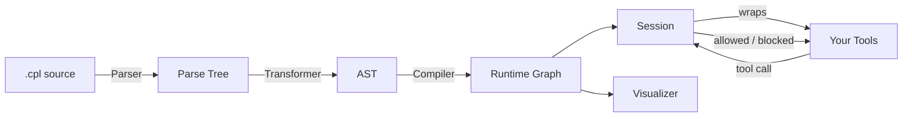

<p align="center">
  
</p>

<h1 align="center">complier</h1>

<p align="center">
  <strong>Contract enforcement for tool-using AI agents</strong>
</p>

<p align="center">
  <a href="https://github.com/kavishsathia/complier/actions"></a>
  <a href="https://codecov.io/gh/kavishsathia/complier"></a>
  <a href="https://github.com/kavishsathia/complier/blob/main/LICENSE"></a>
  <a href="https://www.python.org/"></a>
</p>

## Overview

This language and framework allows you to define what your agent **can** do. It's meant to be a middle ground between n8n's workflows, which remove much of the runtime judgement an agent can have, and OpenClaw's runtime, which can literally do anything given a set of tools.

### Motivation

In December 2025, I developed [Sworn](https://github.com/kavishsathia/sworn). The core insight was: **the system prompt can act as both a directive for the agent and a source of truth to verify against**. You write a contract, the agent fulfils it, then check the deliverables against that contract.

I knew this was quite handwavy, getting another agent to review your agent's work doesn't guarantee much. But the bigger problem was that **verification was after the fact**. OpenClaw took off in January and we've seen how it can cause catastrophes mid-execution. We need something that **exists alongside the agent's runtime**, not after.

I did lose some sleep over this, and I eventually conceded it was the best I could offer. Between then and now (April 2026) though, I've learnt a lot. I wrote my own compiled programming language called [Star](https://github.com/kavishsathia/star), discovered the pattern of **intercepting tool calls not only to read them but to edit them entirely** to augment the agent's runtime ([Gauntlet](https://github.com/kavishsathia/gauntlet)), worked with parallel agents and tested out contracts within the same project ([Vroom](https://github.com/kavishsathia/vroom)), and most importantly, serendipitously rediscovered [HATEOAS](https://en.wikipedia.org/wiki/HATEOAS) when I accessed my old Notion notes (from when I just started programming).

The result after all that is a DSL to define loosely what your agent can do, and the interesting thing is: it's not just natural language like contracts v1, here we can actually **compile your DSL into a runtime graph**. The graph answers two important questions: **(1) can your agent do what it just did?** and **(2) what can your agent do next?** (just like HATEOAS). The big question now is: how do we communicate the state of the graph to the agent when it's executing? We can **piggyback on tool calls**, and when tool calls return, we **envelope them with information that the agent needs to know**, or even **reject tool calls** if it doesn't meet the workflow definition.

The entire framework relies on these critical insights that you just read.

## Features

- **Custom DSL** — A purpose-built language for defining agent workflows. Supports tool calls with parameters, `@llm` and `@human` steps, subworkflow invocation (`@call`, `@use`, `@inline`), branching, loops, unordered blocks, and parallel execution with `@fork`/`@join`.

- **Compiled runtime graph** — Your DSL compiles down (parse → AST → graph) into a directed node graph. At any point in execution, the graph knows what just happened and what's allowed next.

- **Contract checks** — Guard expressions that gate steps before they run. Model checks (`[check]`), human checks (`{check}`), and learned checks (`#{check}`) can be composed with `&&`, `||`, `!`, then wrapped with an expression-level policy such as `([check] && !{other}):halt`. If no policy is written, the default is 3 retries.

- **Guarantees** — Reusable contract expressions (`guarantee <name> <expr>`) that can be attached to entire workflows with `@always`, so certain invariants hold on every step.

- **Session tracking** — A `Session` binds a compiled contract to mutable runtime state, tracking the active workflow, completed steps, branch conditions, and a full event history. When a tool call is blocked, the agent gets a structured `BlockedToolResponse` with remediation info.

- **Function wrapping** — `Session.wrap(func)` wraps any Python callable (sync or async) so that contract enforcement happens transparently at the function boundary.

- **Visualizer** — A local web server (`Session.visualize()`) that serves your compiled contract as an interactive graph, so you can see the workflow topology and node types at a glance.

- **Memory** — A JSON-backed persistence layer for learned checks, allowing knowledge to carry across sessions.

## Installation

```bash
pip install complier
```

Requires Python 3.11+. The only runtime dependency is [Lark](https://github.com/lark-parser/lark).

## Quick Start

Define a contract in a `.cpl` file:

```
guarantee safe [no_harmful_content]:halt

workflow "research" @always safe
    | @human "What topic?"
    | search_web
    | summarize style=([relevant] && [concise]):halt
    | @branch
        -when "technical"
            | @llm "Write detailed analysis"
        -else
            | @llm "Write brief summary"
    | @call send_report
```

Load it, wrap your tools, and go:

```python
from complier import Contract, wrap_function

contract = Contract.from_file("workflow.cpl")
session = contract.create_session()

# wrap your tools — contract enforcement happens transparently
safe_search = wrap_function(session, search_web)
safe_summarize = wrap_function(session, summarize)

# fire up the visualizer to see the workflow graph
server = session.visualize()
print(f"Visualizer running at {server.url}")
```

Wrapped functions behave exactly like the originals, except the session checks each call against the compiled graph. If a call isn't allowed at that point in the workflow, the agent gets a `BlockedToolResponse` with remediation info instead.

## Architecture



The pipeline has three compilation stages and a runtime layer:

1. **Parser** — A Lark-based LALR parser tokenizes your `.cpl` source into a parse tree. A custom indenter handles the whitespace-sensitive syntax.

2. **Transformer** — Walks the parse tree and produces a strongly-typed AST. Guarantees, workflows, steps, and contract expressions all become proper dataclasses at this stage.

3. **Compiler** — Converts the AST into a directed graph of `RuntimeNode`s. Each workflow becomes a `CompiledWorkflow` with a node lookup table and execution edges. Control flow constructs (branches, loops, unordered blocks, fork/join) get their own node types with merge points. `@always` guarantees are inlined as guards on every executable node.

4. **Session** — Binds a compiled `Contract` to mutable state (active workflow, completed steps, event history). When a wrapped tool is called, the session checks it against the graph: is this tool allowed at this point? And either lets it through or returns a `BlockedToolResponse` with remediation info. And this part is inspired by HATEOAS: the graph always knows what can happen next, and the agent is told.

5. The **Visualizer** taps into the same compiled graph, serializing it as JSON and serving it over a local HTTP server so you can see the workflow topology in your browser.

## Contributing

Contributions are welcome. Open an issue first if you're planning something non-trivial so we can align on direction. I would really appreciate any discourse on this too, even if you're not planning to contribute.

```bash
git clone https://github.com/kavishsathia/complier.git
cd complier
pip install -e ".[dev]"
pytest
```

## License

[MIT](LICENSE) — Kavish Sathia, 2026.
